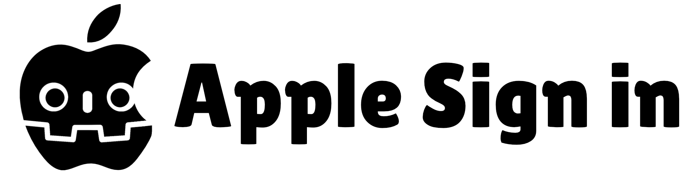

A Godot Swift extension that adds Apple Sign In functionality for both iOS and macOS.

<p align = "center">
    <strong>
        <a href="https://discord.gg/56dMud8HYn">Discord</a> | <a href="https://appsinacup.com/apple-sign-in/">Guide</a> 
    </strong>
</p>

# Install

## From Godot Assets

Download from [Godot Asset Library](https://godotengine.org/asset-library/asset/4544).

## From GitHub

The automated actions should also export binaries. Download [latest](https://github.com/appsinacup/godot-apple-login/releases/download/nightly/godot_apple_login.zip).## Install

Copy the addons folder in order to install.

# Configure

For iOS, set at Project -> Export -> iOS -> `entitlements/additional`:

```xml
<key>com.apple.developer.applesignin</key>
<array>
    <string>Default</string>
</array>
```

For macOS, set the same entitlements as above (eg. when running codesign):

```sh
codesign --force --options=runtime --verbose --timestamp \
  --entitlements entitlements.plist --sign "<SIGN_ENTITY>" \
  "MyApp.app/Contents/MacOS/MyApp"
```

where `entitlements.plist` contains again:

```xml
<key>com.apple.developer.applesignin</key>
<array>
    <string>Default</string>
</array>
```

# Test

Now you can do in GDScript:

```py
var apple_sign_in:= AppleSignIn.new()

func _ready() -> void:
	apple_sign_in.apple_output_signal.connect(apple_output_signal)
	apple_sign_in.sign_in()

func apple_output_signal(id, email, name, error):
	if error:
		print("Error: ", error)
	else:
		print("Success: ", id, email, name)
```

# Build

Build locally after installing XCode:

```sh
./build.sh release
```

## Notes

- Based on https://github.com/BadalAc/godot-apple-ios-login-plugin with extra gh actions, macos client and high level API.
